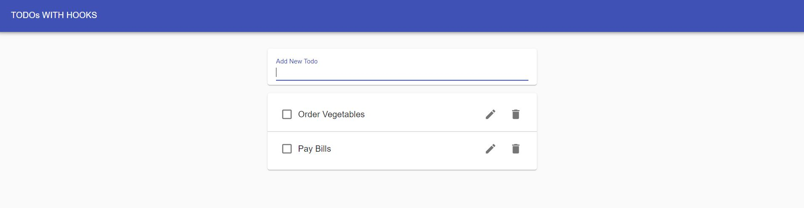

# react-boot-camp

# Pokemon App

# Coin Flip

# Yahtzee Game

# Dog App

## Covers React Router

#SignIn Form

## Covers useContext. Theme and Language changes are passed using Context

# ToDo APP

## Covers useState, useContext, useReducer

